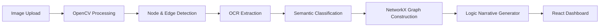

# 🧠 Intelligent Node Detection & Diagram-to-Graph System

A state-of-the-art full-stack application that transforms handwritten or digital diagram images into structured, human-readable logical workflows.

---

## 🌟 Strategic Features

### 🔍 High-Accuracy Detection Engine
- **Proximal Merging**: Sophisticated clustering logic that collapses fragmented shapes into unified **Logical Nodes**.
- **3-Step Filtration**:
    - **Confidence Guard**: Filters low-quality detections (< 0.4 confidence).
    - **Noise Flush**: Eliminates non-structural artifacts using area-based thresholding (> 500px).
    - **Semantic Rerouting**: Identifies edge labels (Yes, No, True, False) and associates them with logical connections.

### 🤖 Intelligent Logic Interpreter
- **Automated Narratives**: Translates complex directed graphs into chronological human-language instructions.
- **Context-Aware Branching**: "Decision" nodes (diamonds) are automatically translated into "If/Then" logic paths.
- **Graph Traversal**: Uses BFS-based logic to ensure a natural flow from **Start** to **End**.

### 📊 Professional Visualization
- **Force-Directed Graph**: Interactive 2D visualization with labeled edges and semantic color-coding.
- **Logical Steps Viewer**: A dedicated UI tab for reading the auto-generated workflow narrative.
- **Real-Time Analysis**: Instant processing with persistent image previews for visual evidence.

---

## 🏗️ Architecture



---

## 🚀 Installation & Setup

### Prerequisites
- Python 3.11+
- Node.js 18+
- Tesseract OCR (installed on system)

### Backend (FastAPI)
1. Navigate to the backend directory:
   ```bash
   cd backend
   ```
2. Create and activate a virtual environment:
   ```bash
   python -m venv venv
   venv\Scripts\activate  # Windows
   source venv/bin/activate # Linux/Mac
   ```
3. Install dependencies:
   ```bash
   pip install -r requirements.txt
   ```
4. Start the server:
   ```bash
   python -m uvicorn app.main:app --reload
   ```

### Frontend (React + Vite)
1. Navigate to the frontend directory:
   ```bash
   cd frontend
   ```
2. Install packages:
   ```bash
   npm install
   ```
3. Launch development server:
   ```bash
   npm run dev
   ```

---

## �️ Technology Stack

| Layer | Technologies |
|------|--------------|
| **Core AI** | OpenCV, NumPy, Tesseract OCR |
| **Logic** | NetworkX (DiGraph), Custom BFS Traversal |
| **Backend** | FastAPI, Gunicorn/Uvicorn |
| **Frontend** | React 18, Vite, Force-Graph-2D, Lucide Icons |
| **Design** | Glassmorphic CSS, Responsive Layouts |

---

## � Evaluation
Run the built-in evaluation script to check performance on sample diagrams:
```bash
python evaluate.py backend/data/samples/flowchart.png
```

---

## 📝 Credits & Development
© 2026 Intelligent Node Detection System
**Developed by Kaif**
